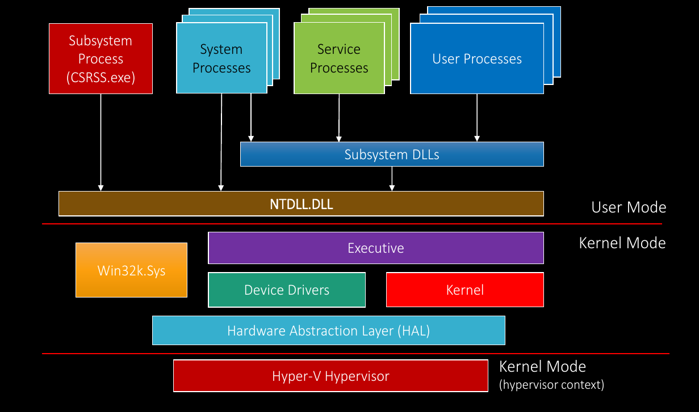

# Kernel
- HAL
- Kernel - thread scheduling, interup
- Device Drivers
- Executive - virtual memory manager, object manager, security, IPC, power manager
- Win32K.sys - user interface and graphics
# User
- User applications
- System process - Logon, session manager, SCM
- Services
- Subsystem process - csrss.exe (Windows subsystem process)
- Subsystem DLLs - kernel32.dll, user32.dll, advapi32.dll
- NTDLL.DLL
--- 
