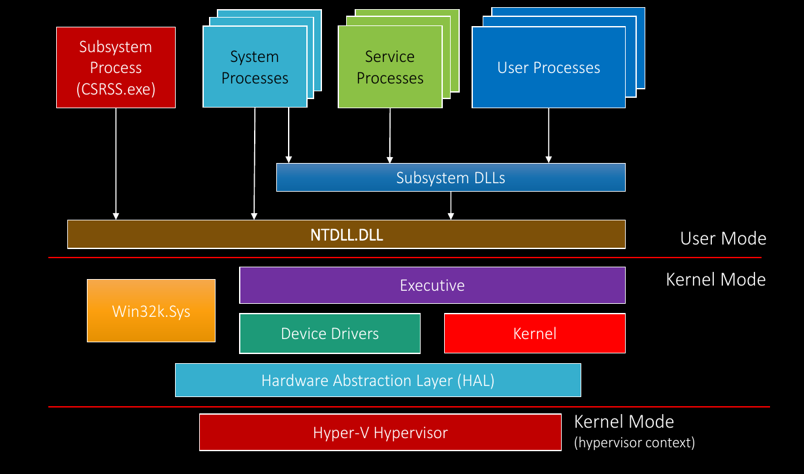

# OS Model
- Windows is a multi-user operating system, where application is separated from the OS.
- The kernel code runs in the `privileged mode` also known as the kernel mode.
	- Kernel mode has access to all the system data and hardware
- The user application runs in the `non-privileged mode` also known as user mode.
	- User mode has limited access to the system data.
- The user mode, when requires system service, the system service executes a special instruction (interrupt), switches the thread to the kernel mode.
- Windows kernel is `monolithic` in nature like most UNIX kernels.
- Which means that, OS, kernel code and the device drives, all share the same `kernel-mode protected memory space`.

--- 
- User mode process runs in user mode (ring 1)
- Kernel code runs in kernel mode (ring 0)
- Hypervisor also runs in kernel mode (ring 0) but uses special CPU instructions (Vt-x on Intel and SVM on AMD). It is also frequently termed as ring -1, which is inaccurate
##### User Component
  - *User Process*: Native 32 and 64 bit process. Modern Process running over Windows Runtime (WinRT)
  - *Service Process*: Process hosting windows services, such as task scheduler. They run independently of User logons. They are started by `Service Control Manager`
  - *System Process*: Hardwired process such as logon manager/session manager but are not windows services. They are not started by `Service Control Manager`
  - *Environment Subsystem Server Process*: Supports OS environment. Originally windows supported three windows subsystem:
	  - Windows/Win32
	  - OS/2 - Deprecated
	  - POSIX - Deprecated
User Process and the Service Processes do not call the windows OS directly, they go through the *SubSystem DLLs*. These are document code and calls the undocumented native system services implemented in `Ntdll.dll`.
##### Kernel Components
- *Executive* - The Base OS. Manages memory, process, threads, security, I/O, networking etc.
- *Kernel* - Low level OS functions such as thread scheduling, interrupt, mutliprocessor synchronisation etc.
- *Device Drivers* - Hardware device drivers, translates user I/O functions calls into specific hardware device I/O. Filesystem and network deivces.
- *Hardware Abstraction Layer* - Isolates the executive kernel and Device driver from the actual hardware.
- *Windowing And Graphics System* - Implements the GUI. (win32k.sys)
- *Hypervisor Layer*
- Core Windows Files:
	- `NtOskrnl.exe` - Kernel & Executive
	- `Hal.dll` - HAL
	- `Win32k.sys` - Kernel mode driver part for windows subsystem (GUI)
	- `Hvix64.exe - Intel` - Hypervisor
	- `Hvax64.exe - AMD` - Hypervisor
	- `*.sys` - Drivers
	- `Ntdll.dll` - Internal Support function and System Service Dispatch stubs to executive functions.
	- `Kernel32.dll, Advapi32.dll, User32.dll, Gdi32.dll` - Core windows subsystem DLLs